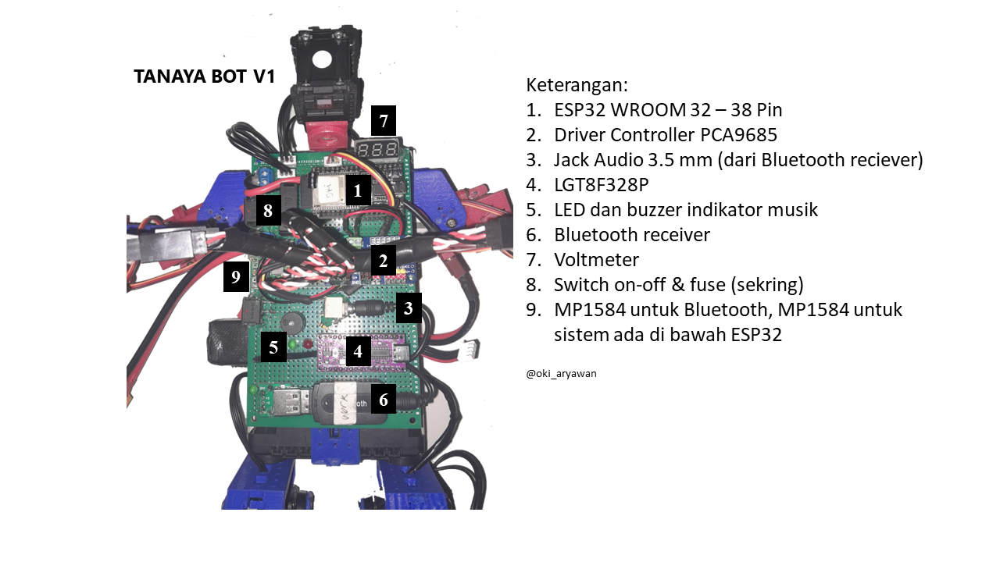
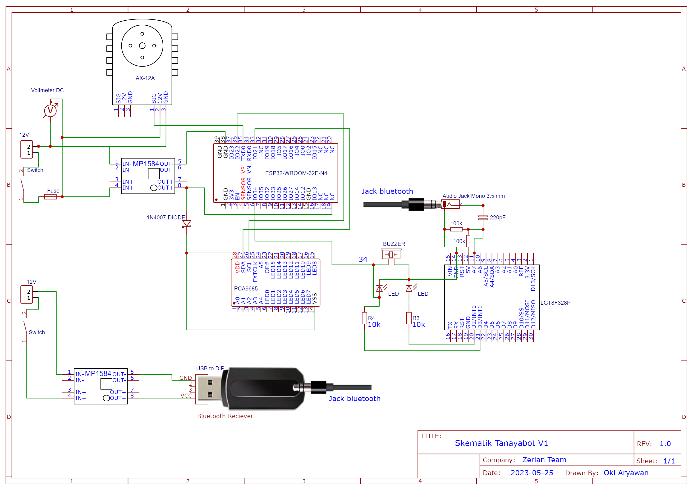
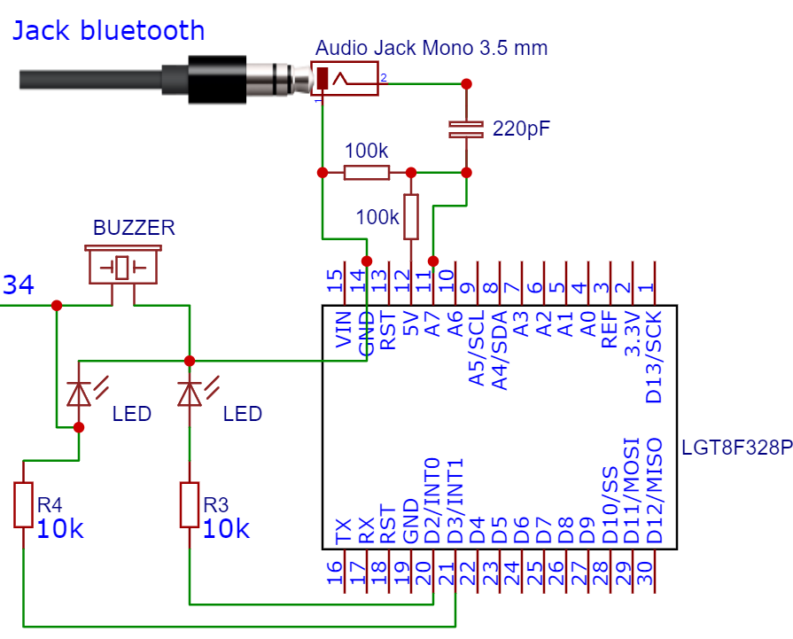

# Dokumentasi Elektronika Tanaya V1 - KRSTI 2023
Tanaya adalah robot humanoid yang dikembangkan untuk Kontes Robot Indonesia (KRI) 2023 divisi robot tari (KRSTI). Berikut merupakan dokumentasi komponen elektronika robot Tanaya.
## 
ELECTRONICS

  

  

## Mikrokontroler

ESP32

Jenis ESP32 yang digunakan pada Tanaya ini adalah model 38 pin. Pemilihan ESP32 berdasarkan kemampuannya yang stabil untuk menggerakkan AX-12A melalui pin TX (transmitter). Selain itu, memori dan RAM yang dimiliki ESP32 model ini juga cukup dan ukurannya yang compact dan mudah dipasang untuk robot humanoid. 

LGT8F328P

Mikrokontroler ini identik dengan Arduino Nano. Penggunaan jenis ini untuk menerima dan mengolah data audio yang ditransmisikan dari bluetooth reciever. Dari jack audo menggunakan prinsip ADC yang masuk ke pin A7. Pemilihan nomor pin analog bebas, disesuakan dengan kondisi rangkaian. Ketika lagu diputar, maka jack audio akan memberikan sinyal high yang diolah dengan rangkaian pengubah gelombang AC ke DC yang kemudian masuk ke pin A7 yang akan memberikan nilai 1023 (10 bit). Ketika ini terjadi, maka pin D3 akan bernilai HIGH yang menyalakan led, buzzer dan menjadi input pada pin 34 di ESP32.

  

PCA9684 Servo Controller

Untuk mempermudah proses kontrol servo MG90S, makan menggunakan PCA9685 dengan maksimal 16 channel. Kontroler ini dapat terhubung dengan ESP32 dengan komunikasi SDA dan SCL (pin 21 dan 22 di ESP32). Satu hal yang sangat perlu untuk diperhatkan pada kontroler ini adalah kemungkinan adanya feedback voltage yang bisa berpotensi menghancurkan sumber power supply (dalam hal ini juga terhubung ke ESP32). Selama proses riset sudah menghanguskan 4 ESP32. Jadi untuk mencegahnya dipasang dioda 1N4007 pada kutub positif power supply.
  

## Aktuator

Dynamixel AX-12A

Servo ini memiliki kemampuan yang sangat mumpuni dalam membuat robot humanoid. AX-12A dapat dikendalikan dengan komunikasi TX dari ESP32 ke pin input dan menggunakan supply 12V. Setiap AX-12A memiliki ID yang memudahkan program dan dapat dihubungkan secara kontinu dari satu AX-12A ke lainnya.   

Dynamixel AX-12A

Servo ini memiliki kemampuan yang sangat mumpuni dalam membuat robot humanoid. AX-12A dapat dikendalikan dengan komunikasi TX dari ESP32 ke pin input dan menggunakan supply 12V. Setiap AX-12A memiliki ID yang memudahkan program dan dapat dihubungkan secara kontinu dari satu AX-12A ke lainnya.   

Servo MG90S

Servo ini digunakan karena ukurannya yang kecil dan ringan, hingga cocok untuk bagian lengan yang tidak memiliki beban (load). Servo ini memiliki tegangan rendah dan dikendalikan dengan pwm dari PCA9685. Namun, dalam proses riset robot tanaya, servo jenis ini memberikan berbagai masalah, sehingga untuk selanjutnya keseluruhan aktuator diharapkan dapat menggunaan AX-12A. :))

## Kelengkapan Lain
- Bluetooth Reciever
- Stepdown MP1584
- Fuse (sekring)
- Switch on-off
- Baterai Lippo 12V 3S
- Voltmeter

catatan: power supply untuk bluetooth reciever harus dipisahkan dengan sistem agar pembacaan nilai audio dapat berjalan dengan baik. 
Written by: [Oki Aryawan](https://www.instagram.com/oki_aryawan/)

